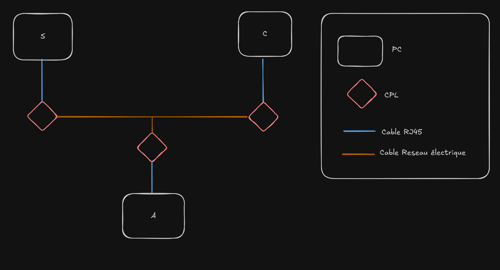

# Recherche sur les failles des CPL

## Introduction
Les Courants Porteurs en Ligne (CPL) sont une technologie permettant de transmettre des données via le réseau électrique. Bien que pratiques, ces dispositifs soulèvent des questions de sécurité. Ce papier explore la possibilité d'attaques de *type man-in-the-middle* lorsqu'un CPL est ajouté à un réseau existant.

## Problématique
L'ajout d'un adaptateur CPL sur un réseau existant peut-il introduire une vulnérabilité permettant une attaque MITM ? Cette recherche vise à répondre à cette question en analysant les mécanismes de sécurité des CPL et les scénarios d'attaque possibles.

## Méthodologie
1. **Présentation des tests** 
2. **Résultat attendu**
3. **Test et résultat**
4. **Interprétation des résultats**

## Présentation des tests
Afin d'effectuer nos tests, nous alons utiliser 3 ordinateurs portables, 3 adaptateurs CPL. Les ordinateurs seront connectés chacun à un adaptateur CPL, et les adaptateurs seront interconnectés via le réseau électrique. Les 2 premiers ordinateurs seront utilisés pour simuler un échange de données, tandis que le troisième ordinateur sera utilisé pour tenter d'intercepter ces données.

Nous allons configurer les adaptateurs CPL pour qu'ils soient sur le même réseau.

Sur le premier ordinateur (appeler S ou Serveur), nous allons lancer un serveur HTTP simple. Sur le deuxième ordinateur (appeler C ou Client), nous allons utiliser un navigateur pour accéder à ce serveur. 
Le troisième ordinateur (appeler A ou Attaquant) sera configuré pour écouter le trafic réseau. 

*Schéma du test :*

Dans un premier temps, nous allons vérifier si le trafic entre les deux premiers ordinateurs est distribué au PC A.

Si les trames ne sont pas distribuées, nous allons tenter de forcer la distribution en utilisant un outil de type ARP poisoning ou en effectuant du *spoofing* d'adresse MAC.

Si nous arrivons à distribuer les trames, nous allons tenter de lire les données échangées entre S et C en utilisant un outil de capture de paquets comme Wireshark.

Configuration réseaux :
| Ordinateur    | Adresse IP | Adresse MAC |
|-|-|-|
| S (Serveur)   | TBD        | TBD        |
| C (Client)    | TBD        | TBD        |
| A (Attaquant) | TBD        | TBD        |

## Résultat attendu

Nous nous attendons à ce que le trafic entre S et C soit visible sur l'ordinateur A. Si les trames ne sont pas distribuées au pc A, nous devrions être en mesure de forcer leur distribution en utilisant des techniques d'ARP poisoning ou de spoofing d'adresse MAC.

Si nous réussissons à capturer le trafic, nous devrions être en mesure de lire les données échangées entre S et C, ce qui confirmerait la possibilité d'une attaque MITM sur un réseau CPL. Nous allons également documenter les étapes de notre test pour une analyse ultérieure.

Nous penssons que les adaptateurs CPL ne rajoute pas de sécurité supplémentaire par rapport à un réseau Ethernet avec 3 ordinateurs connectés à un switch, et que les mêmes techniques d'attaque peuvent être appliquées.

## Test et résultat

### Test 1 : Vérification de la distribution des trames
Pour ce test, nous allons utiliser Wireshark sur l'ordinateur A pour vérifier si les trames entre S et C sont visibles. Nous allons démarrer la capture de paquets sur l'interface réseau de l'ordinateur A avant de lancer le serveur HTTP sur S et d'accéder à celui-ci depuis C.

### Résultat du Test 1
Après avoir démarré la capture de paquets sur l'ordinateur A, nous avons lancé le serveur HTTP sur l'ordinateur S et accédé à celui-ci depuis l'ordinateur C. Cependant, nous n'avons pas observé de trames entre S et C sur l'ordinateur A. Cela indique que les trames ne sont pas distribuées au PC A.

### Test 2 : Forçage de la distribution des trames
Les trames ne sont pas visibles sur l'ordinateur A, nous allons tenter de forcer leur distribution en utilisant un outil d'ARP spoofing. Nous allons configurer l'ordinateur A pour usurper l'adresse MAC de l'ordinateur S et C, puis relancer la capture de paquets sur Wireshark.

### Résultat du Test 2
Après avoir usurpé les adresses MAC de S et C, nous avons relancé la capture de paquets sur l'ordinateur A. Cette fois, nous avons observé des trames entre S et C sur l'ordinateur A. Cela confirme que nous avons réussi à forcer la distribution des trames au PC A.

### Test 3 : Capture et analyse des données échangées
Nous allons maintenant tenter de lire les données échangées entre S et C en utilisant Wireshark. Nous allons filtrer les paquets pour ne capturer que ceux liés au protocole HTTP.

### Résultat du Test 3
Après avoir filtré les paquets pour le protocole HTTP, nous avons pu observer les requêtes et réponses HTTP entre S et C. Cela confirme que nous avons réussi à capturer le trafic échangé entre les deux ordinateurs.

## Interprétation des résultats
Les résultats de nos tests montrent que les adaptateurs CPL ne fournissent pas de sécurité supplémentaire contre les attaques MITM par rapport à un réseau Ethernet traditionnel. En effet, nous avons pu forcer la distribution des trames entre S et C sur l'ordinateur A en utilisant des techniques d'ARP spoofing, et nous avons réussi à capturer et lire les données échangées.
Ces résultats soulignent la vulnérabilité des réseaux CPL face aux attaques MITM, et mettent en évidence l'importance de mettre en place des mesures de sécurité supplémentaires, telles que le chiffrement des données, pour protéger les communications sur ces réseaux.

